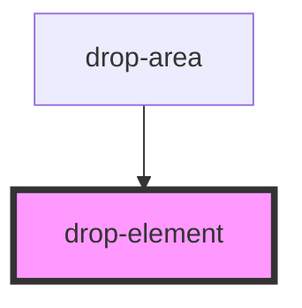

# drop-element

<!-- Auto Generated Below -->

## Properties

| Property | Attribute | Description | Type  | Default     |
| -------- | --------- | ----------- | ----- | ----------- |
| `file`   | `file`    |             | `any` | `undefined` |

## Dependencies

### Used by

 - [drop-area](../drop-area)

### Graph

----------------------------------------------

*Built with [StencilJS](https://stenciljs.com/)*
